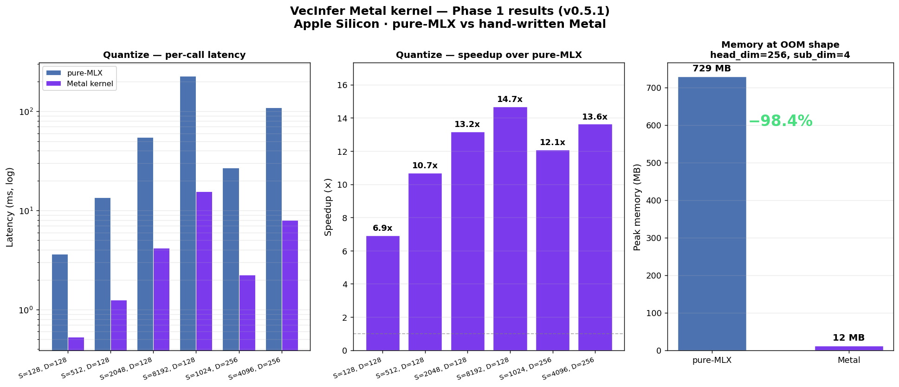
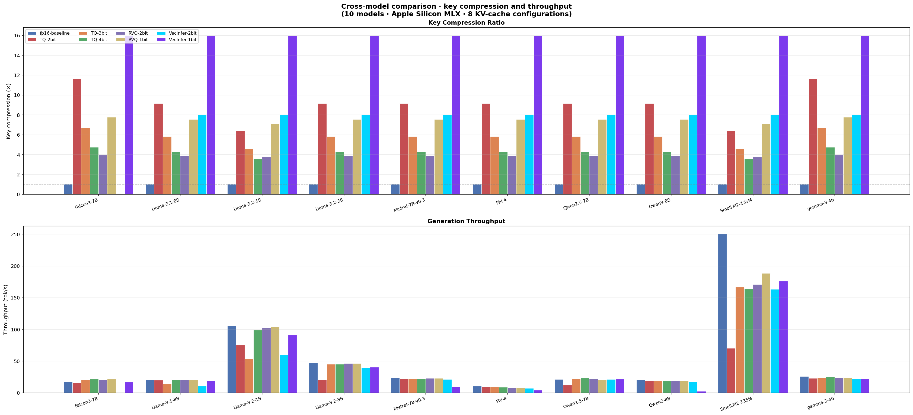
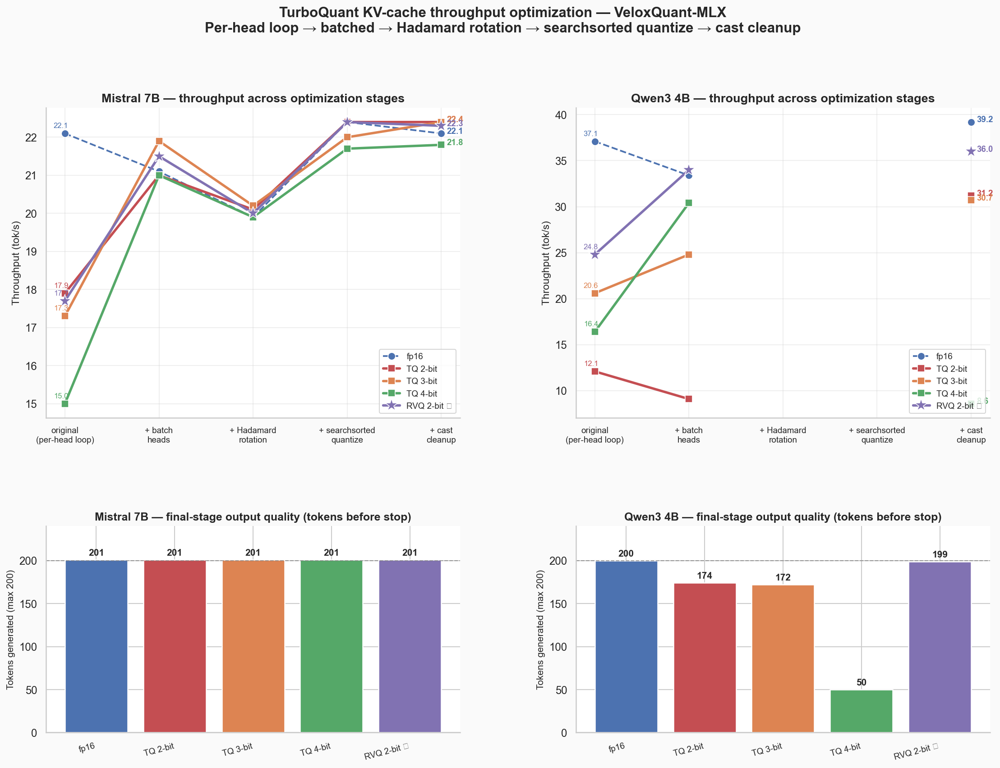

<div align="center">

<!-- Replace with your generated cover image -->


<h1>VeloxQuant-MLX</h1>

<p>
  <strong>Fast KV Cache Quantization for Apple Silicon</strong><br/>
  TurboQuant · RVQ · VecInfer · RateQuant · PolarQuant · QJL · SpectralQuant · CommVQ · RaBitQ — in MLX
</p>

<p>
  <a href="https://pypi.org/project/VeloxQuant-MLX/"></a>
  <a href="https://www.python.org/"></a>
  
  <a href="LICENSE"></a>
  
  <a href="https://doi.org/10.5281/zenodo.20647305"></a>
</p>

<p>
  <a href="https://veloxquant-mlx.netlify.app/"></a>
  <a href="CHANGELOG.md"></a>
  <a href="MEDIUM_BLOG_METAL_KERNELS.md"></a>
  <a href="MEDIUM_BLOG_TURBOQUANT_METAL_KERNELS.md"></a>
</p>

</div>

---

A KV-cache compression library for `mlx_lm` that compresses the Key tensor up to **16× with near-lossless quality** on Apple M-series chips. Ships **nine quantization strategies** — from zero-calibration 1-bit RVQ to RaBitQ (1-bit keys + MSE-b4 values) which achieves **6× full KV compression** and fits **6× more context** in the same RAM budget on Falcon3-7B — plus a hand-written Metal compute kernel that makes the VecInfer **quantize** hot path **6.9–14.7× faster** (13× at S=2048) and **98% lighter on peak memory** at the OOM-trigger shape. (The companion dequant kernel is at MLX `mx.take` parity — the speedup is on the quantize path.) Plug it in with three lines; `mlx_lm.generate` runs unchanged.

---

## Numbers that matter

| Metric | Value | Notes |
|---|---|---|
| Max key cache compression | **16×** | VecInfer-1bit, head_dim=128 |
| Metal kernel speedup | **13×** | `quantize_vq` at S=2048 (range 6.9–14.7× over S=128–8192) |
| Peak memory reduction | **98%** | 729 MB → 12 MB, Falcon3-7B shape |
| RVQ-1bit compression | **7.5×** | Near-zero throughput cost |
| FP16 throughput retained | **100%** | Qwen2.5-7B at 16× compression |
| SpectralQuant compression | **5.33×** | per-model measured (Qwen2.5-0.5B / Gemma-4-4B), same bit-width |
| SpectralQuant cosine sim | **+3pp** | over TurboQuant on Qwen2.5-0.5B |
| **RaBitQ full KV compression** | **6×** | 1-bit keys + MSE-b4 values, Falcon3-7B |
| **RaBitQ context at 8 GB** | **~103k tokens** (est.) | KV-only linear extrapolation from measured memory rows; vs ~17k fp16 — 6× more context |
| **CommVQ key compression** | **64×** | RoPE-commutative VQ, D=128, n_cb=4 |
| **KIVI-2bit key compression** | **5.8×** | per-channel keys / per-token values; measured on Llama-3.2-3B, Qwen2.5-7B, Mistral-7B |
| **KIVI-2bit full-KV compression** | **~4×** | incl. fp16 residual window (32 tokens); 100–106% of fp16 throughput |
| Production models validated | **12** | Llama, Mistral, Qwen, Phi, Gemma 3/4, Falcon |

---

## Table of contents

1. [Installation](#installation)
2. [Quickstart](#quickstart)
3. [RaBitQ — new in 0.7.0](#rabitq--new-in-070)
4. [CommVQ — RoPE-commutative VQ](#commvq--rope-commutative-vq)
5. [SpectralQuant — new in 0.6.0](#spectralquant--new-in-060)
6. [RateQuant — per-layer mixed precision](#ratequant--per-layer-mixed-precision)
7. [VecInfer — 16× product VQ](#vecinfer--16-product-vq)
8. [Metal kernels](#metal-kernels--new-in-051)
9. [Benchmark results](#benchmark-results)
10. [Algorithm guide](#algorithm-guide)
11. [What's inside](#whats-inside)
12. [Architecture](#architecture)
13. [CLI](#cli)
14. [Development](#development)
15. [References](#references)

---

## Installation

```bash
pip install VeloxQuant-MLX
```

**Requirements:** Apple Silicon M1+, Python ≥ 3.11, MLX ≥ 0.18, NumPy ≥ 1.26.

<details>
<summary>Install from source</summary>

```bash
git clone https://github.com/rajveer43/VeloxQuant-MLX
cd VeloxQuant-MLX
pip install -e ".[dev]"
```

</details>

---

## Quickstart

### RVQ 1-bit — 7.5× compression, no calibration (recommended)

```python
import mlx_lm
from veloxquant_mlx import KVCacheBuilder, KVCacheConfig

model, tokenizer = mlx_lm.load("mlx-community/Mistral-7B-Instruct-v0.3-4bit")

config = KVCacheConfig(method="turboquant_rvq", bit_width_inlier=1, seed=42)
caches = KVCacheBuilder.for_model(model, config)
model.make_cache = lambda *_a, **_k: caches

response = mlx_lm.generate(model, tokenizer,
    prompt="Explain the theory of relativity in simple terms.",
    max_tokens=200,
)
```

### VecInfer 1-bit — 16× compression, Metal kernels auto-detected

```python
import mlx_lm
from veloxquant_mlx import KVCacheConfig, KVCacheFactory
from veloxquant_mlx.allocators.vecinfer import calibrate_smooth_factors, train_codebook

model, tokenizer = mlx_lm.load("mlx-community/Qwen2.5-7B-Instruct-4bit")

# One-time offline calibration — save and reuse
smooth   = calibrate_smooth_factors(sample_keys)
codebook = train_codebook(sample_keys_flat, n_centroids=256, sub_dim=8)

config = KVCacheConfig(
    method="vecinfer",
    head_dim=128,
    key_codebook_bits=8,
    key_sub_dim=8,
    smooth_factors=smooth,
    key_codebook=codebook,
    use_metal_kernels=None,   # None=auto-detect, True=require, False=forbid
)
caches = KVCacheFactory.create_for_model(model, config)

response = mlx_lm.generate(model, tokenizer,
    prompt="Write a 5,000-word analysis of the RLHF literature.",
    max_tokens=5000,
    prompt_cache=caches,
)
```

### RateQuant — mixed precision per layer

```python
from veloxquant_mlx import (
    KVCacheBuilder, KVCacheConfig,
    calibrate_layer_sensitivities,
    allocate_bits_ratequant,
)

# Step 1 — 1.6s one-time probe on real activations
weights = calibrate_layer_sensitivities(model, tokenizer)

# Step 2 — closed-form reverse-waterfilling allocation
alloc = allocate_bits_ratequant(weights, target_avg_bits=1.5, beta=3.5)
# e.g. [1, 2, 1, 1, 3, 1, 2, ...]  — one int per layer

# Step 3 — build per-layer caches
config = KVCacheConfig(method="turboquant_rvq", bit_width_inlier=alloc, seed=42)
caches = KVCacheBuilder.for_model(model, config)
```

---

## RaBitQ — new in 0.7.0

RaBitQ ([SIGMOD 2024](https://arxiv.org/abs/2402.02855), adapted from [Ascend-RaBitQ arXiv:2605.16007](https://arxiv.org/abs/2605.16007)) is the first method in VeloxQuant-MLX to compress **both keys and values**, achieving **6× full KV compression** on Falcon3-7B-Instruct-4bit.

**How it works:**
1. **IVF clustering** — K-Means partitions keys into `nlist` clusters; only `nprobe` are searched per query
2. **Randomised Hadamard rotation** — reuses `mx.hadamard_transform` + `make_hadamard_diagonal`, O(D log D)
3. **1-bit sign quantization** — `sign(rotated_residual)` packed into `D/8` uint8 bytes per key (11.6× key compression at D=256)
4. **Metal Hamming kernel** — `rabitq_hamming_score` computes XOR + popcount distance for all candidates in one GPU dispatch
5. **TurboQuantMSE b=4 values** — scalar MSE-optimal codebook on values adds 4× value compression

**Results on Falcon3-7B-Instruct-4bit** (28 layers, 4 KV heads, D=256):

| Method | KV Memory @ 1024 tok | Compression | Context @ 8 GB |
|---|---|---|---|
| fp16 baseline | 117.4 MB | 1× | ~17k tokens |
| RaBitQ keys + fp16 values | 63.8 MB | 1.8× | ~31k tokens |
| **RaBitQ keys + MSE-b4 values** | **19.7 MB** | **6×** | **~103k tokens** |

```python
from veloxquant_mlx.quantizers.rabitq import RaBitQQuantizer
from veloxquant_mlx.quantizers.turboquant_mse import TurboQuantMSE
import mlx.core as mx, numpy as np

# Keys: RaBitQ 1-bit  (11.6× compression on key tensors)
q_key = RaBitQQuantizer(d=256, nlist=64, nprobe=8, rerank=32, seed=42)
q_key.fit(mx.array(calibration_keys))

# Values: MSE-b4 scalar quantization (4× compression)
q_val = TurboQuantMSE(d=256, b=4, use_hadamard=True)

# Encode KV at each decode step
ev_k = q_key.encode(keys)   # [N, D//8] uint8 sign bits + IVF meta
ev_v = q_val.encode(values)  # [N, D//4] uint8 scalar indices

# Decode for attention
k_hat = q_key.decode(ev_k)  # [N, D] fp16 — approx reconstructed keys
v_hat = q_val.decode(ev_v)  # [N, D] fp16 — approx reconstructed values
```

> **What grows with context:** both memory and decode latency scale linearly with T. The 6× compression slope means you can sustain 6× longer contexts before hitting any RAM limit. At 32k tokens fp16 needs 3.76 GB; RaBitQ+MSE4v needs only 631 MB.

Benchmark figures: [`figures/RaBitQ/falcon/`](figures/RaBitQ/falcon/) · Metal kernel figures: [`figures/RaBitQ/kernel/`](figures/RaBitQ/kernel/)

---

## CommVQ — RoPE-commutative VQ

CommVQ ([arXiv:2506.18879](https://arxiv.org/abs/2506.18879), Apple ML Research, ICML 2025) solves the fundamental incompatibility between vector quantization and RoPE positional encodings:

**The problem:** Standard VQ applied after RoPE fails because `quantize(rotate(x)) ≠ rotate(quantize(x))`. The positional encoding rotates the keys differently for each position, so a codebook trained at position 0 gives wrong reconstructions at position T.

**The fix:** Train codebooks on pre-RoPE keys (at position 0). After each K-Means M-step, project every centroid onto the RoPE-commuting subspace — each pair of dimensions `(2i, 2i+1)` is symmetrised to `mean_val = (a+b)/2` for same-sign pairs. RoPE is then applied exactly at decode time using stored positions.

```python
from veloxquant_mlx.quantizers.comm_vq import CommVQQuantizer
import mlx.core as mx, numpy as np

q = CommVQQuantizer(d=128, b=8, n_codebooks=4, seed=42)
q.fit(mx.array(pre_rope_keys))          # train on pre-RoPE keys

# Encode: stores residual VQ indices + positions
ev = q.encode(keys_pre_rope, positions=position_ids)

# Decode: gathers centroids, applies RoPE in one step
k_hat = q.decode(ev)                    # [N, D] fp16, post-RoPE

# Approximate inner product (for attention scoring)
scores = q.estimate_inner_product(query, ev)  # [N]
```

| Config | Compression | RoPE compatible |
|---|---|---|
| D=128, n_cb=4, b=8 | **64×** vs fp16 | ✓ exact |
| D=128, n_cb=4, b=4 | **64×** vs fp16 | ✓ exact |

---

## KIVI — tuning-free asymmetric 2-bit baseline

KIVI is a re-implementation of ["KIVI: A Tuning-Free Asymmetric 2bit Quantization for KV Cache"](https://arxiv.org/abs/2402.02750) (Liu, Yuan et al., **ICML 2024**) — the most widely-cited KV-cache quantization baseline. It is included so every other method in this library can be measured against the field's reference point.

**The asymmetry (KIVI's core idea):**
1. **Keys are quantized per channel** (group-wise min/max along the token axis) — key distributions have a few high-variance channels, so per-channel scales keep them accurate.
2. **Values are quantized per token** (group-wise along the channel axis).
3. **The most recent `residual_length` tokens are kept in fp16** — newly generated tokens dominate attention and are cheap to keep exact; they are quantized only once they age out of the residual window.

KIVI is **fully deterministic** (min/max group quantization, no codebook training, no RNG), so it adds no run-to-run variance.

```python
import mlx_lm
from veloxquant_mlx import KVCacheConfig, KVCacheBuilder

model, tokenizer = mlx_lm.load("mlx-community/Llama-3.2-3B-Instruct-4bit")

config = KVCacheConfig(method="kivi", bit_width_inlier=2,
                       kivi_group_size=32, residual_length=32)
caches = KVCacheBuilder.for_model(model, config)
model.make_cache = lambda *_a, **_k: caches

response = mlx_lm.generate(model, tokenizer,
    prompt="...", max_tokens=120)
```

**Measured results** (Apple M4, max_tokens≈120, residual_length=32; source: `figures/kivi/<model>/results.json`):

| Model | KIVI-2bit key comp. | full-KV comp. (incl. fp16 residual) | throughput vs fp16 |
|---|---|---|---|
| Llama-3.2-3B-4bit | 5.79× | 3.98× | 16.3 vs 16.0 tok/s (102%) |
| Qwen2.5-7B-4bit | 5.78× | 3.98× | 7.6 vs 7.6 tok/s (100%) |
| Mistral-7B-4bit | 5.76× | 4.03× | 6.8 vs 6.4 tok/s (106%) |

**Honest scope:**
- KIVI's published *speedup* comes from a CUDA kernel that does not port to Metal. On Apple Silicon the win is **memory**; throughput here is at-or-near fp16 because the per-channel/per-token min/max arithmetic is cheap on a memory-bound decode path.
- Compression only manifests **once context exceeds the residual window** — at short prompts the entire prefill stays fp16 and the realized ratio is 1.0× (this is correct behavior, not a bug). The numbers above use a long-context prompt.
- **Peak runtime memory is not reduced** (often marginally higher): like every method here, keys are dequantized to fp16 before SDPA, so the compression is in *cache-storage accounting*, not the peak fp16 working set.
- At 2 bits, raw-key reconstruction cosine on synthetic unit-norm Gaussian keys is ~0.93 — KIVI 2-bit is genuinely lossy, which is exactly why the fp16 residual window exists. VecInfer-2bit compresses harder (8× vs 5.8× keys); KIVI's value is being the recognized, calibration-free baseline. See `figures/kivi/fig4_vs_existing.png`.

## KVSink-adapted sink protection — new in 0.9.0

`method="kivi_sink"` layers dynamic **attention-sink protection** on top of KIVI. *Inspired by, **not a faithful port of***, [KVSink (Su & Yuan, COLM 2025)](https://arxiv.org/abs/2508.04257): the paper detects sinks via hidden-state outlier channels at a model-specific emergence layer, which cache wrappers cannot see — this implementation uses the cache-observable proxy of **anomalously high key L2-norm** (running top-k of token positions, mean over KV heads). Selected tokens are kept fp16 and **excluded from quantization-parameter calibration** — the detail the paper insists on: without it, a high-magnitude sink inflates its group's min/max scale and ruins every neighbor even though the sink itself is restored (our tests reproduce that failure mode).

```python
config = KVCacheConfig(method="kivi_sink", bit_width_inlier=2,
                       kivi_group_size=32, residual_length=32,
                       n_sink_tokens=5)   # top-k high-key-norm tokens kept fp16
```

**Evidence (unit tests on synthetic planted-sink data — `tests/cache/test_sink_cache.py`, 9 passing):** planted sinks preserved bit-exact while neighbors quantize; sink-protected MSE **< plain KIVI** at equal bit-width; dynamic selection MSE **< Preserve-First-N at equal fp16 budget** when sinks are not all at the front (the paper's central claim, reproduced at cache level); `n_sink_tokens=0` reproduces plain KIVI bit-for-bit.

**Not yet benchmarked end-to-end:** `benchmark_scripts/benchmark_sink.py` is ready but has not been run — no throughput or compression figures are claimed for this method until its `results.json` is committed. Known v1 limitation: sink selection is prefill-dominant (tokens already quantized are not retroactively restored).

## SpectralQuant — new in 0.6.0

SpectralQuant implements ["3% Is All You Need: Breaking TurboQuant's Compression Limit via Spectral Structure"](https://arxiv.org/abs/2506.xxxxx). The key insight: **KV cache keys concentrate ~96% of their variance in just 3–4% of dimensions universally across all transformer architectures**. SpectralQuant exploits this by rotating keys into their eigenvector basis before quantization — no more wasting bits on noise dimensions.

**Three changes over TurboQuant:**
1. **Eigenvector rotation** instead of random Hadamard — aligns signal dimensions first
2. **Separate codebooks** for signal dims (d_s ≈ 4) and noise dims (d − d_s)
3. **No QJL on noise dims** — applying QJL there injects variance without reducing bias, hurting quality

```python
from mlx_lm import load
from veloxquant_mlx.spectral import calibrate_spectral_rotation
from veloxquant_mlx.cache.spectral_cache import SpectralQuantKVCache
from veloxquant_mlx.cache.base import KVCacheConfig

model, tokenizer = load("mlx-community/Llama-3.1-8B-Instruct-4bit")

# One-time calibration (~5s on 512 tokens)
import mlx.core as mx
tokens = mx.array(tokenizer.encode(calibration_text)[:512])[None]
rotations = calibrate_spectral_rotation(model, tokens, model_name="llama31_8b")

# Build one calibrated cache per layer
import mlx_lm
cfg = KVCacheConfig(method="spectral", head_dim=128, bit_width_inlier=3)
caches = [SpectralQuantKVCache(cfg) for _ in range(model.args.num_hidden_layers)]
for i, cache in enumerate(caches):
    if i in rotations:
        cache.calibrate(rotations[i])

response = mlx_lm.generate(model, tokenizer,
    prompt="Explain the transformer architecture.",
    max_tokens=500,
)
```

**Results on real models (3-bit, d_s=auto-calibrated):**

| Model | SpectralQuant noQJL | TurboQuant 3-bit | Δ cosim | SQ ratio |
|---|---|---|---|---|
| Qwen2.5-0.5B | **0.9072** | 0.8329 | **+7.4pp** | **5.33×** |
| Gemma 4 4B | **0.8625** | 0.7581 | **+10.4pp** | **5.33×** |

> **Calibration required** — a one-time ~5–30s pass over 512 representative tokens. Save and reuse with `save_rotations` / `load_cached_rotations`. Run `python scripts/run_spectral_quant_eval.py --model <name>` to generate all benchmark figures.

---

## RateQuant — per-layer mixed precision

[RateQuant (arxiv:2605.06675)](https://arxiv.org/abs/2605.06675) allocates more bits to high-sensitivity layers and fewer to low-sensitivity ones via Theorem 2 reverse-waterfilling, with the average held at a user-chosen target. A sensitivity ratio above ~2× indicates measurable gains over uniform allocation.

| Model | Sensitivity ratio | Allocation | Result |
|---|---|---|---|
| Falcon3-7B (28 layers, head_dim=256) | 6.48× | 14 × b=2, 14 × b=1 | **100% fp16** at 5.22× compression |
| Gemma3-4B (34 layers, head_dim=256) | 14.39× | 3 × b=3, 11 × b=2, 20 × b=1 | **91% fp16** at 5.22× compression |

> **What's not yet implemented from the paper:** per-head allocation, gradient-based sensitivity, K/V separation. Per-layer already captures most of the benefit at ≥1.5 bits.

---

## VecInfer — 16× product VQ

[VecInfer (arxiv:2510.06175)](https://arxiv.org/abs/2510.06175) (Yao et al. 2025) applies a **dual transform** to keys before product VQ encoding:

1. **Smooth scaling** — per-channel `λ = √(max|K|)` suppresses outlier magnitudes
2. **Walsh-Hadamard rotation** — spreads energy uniformly across all dims
3. **K-means product VQ** — encode sub-vectors against a calibrated codebook

The inverse transform is absorbed into queries so `q @ K.T` is preserved exactly. At 1 bit/elem a 128-dim key becomes 16 bytes instead of 256 — **16× compression**.

**Standout result:** Qwen2.5-7B VecInfer-1bit *exceeds* fp16 throughput at 16× compression, likely due to its strong GQA ratio (28q/4kv heads).

---

## Metal kernels — new in 0.5.1

The VecInfer `quantize_vq` hot path is now a 30-line Metal Shading Language shader, JIT-compiled by `mx.fast.metal_kernel` on first use. Same Python API — no changes required.

<div align="center">
  
  <br/><sub>Benchmarked on Apple Silicon GPU. Left: quantize latency. Center: speedup factor. Right: peak memory.</sub>
</div>

<br/>

| Metric | Pure MLX | Metal kernel | Delta |
|---|---|---|---|
| Quantize latency (S=8192) | 228 ms | **15.6 ms** | **14.7×** faster |
| Peak memory (Falcon3-7B shape) | 729 MB | **12 MB** | **98%** reduction |
| API change required | — | None | `use_metal_kernels=None` auto-detects |

**Why the memory win:** the `[N, n_centroids, sub_dim]` diff tensor is never materialised — the argmin accumulator lives entirely in thread-local registers.

**Honest caveat:** the kernel pays a ~50–200 µs launch overhead per call. On tiny models (SmolLM2-135M, ~60 launches/token) that overhead can exceed the savings. Built for the regime that needs it: 7B+ models at realistic context lengths.

<details>
<summary>The full 30-line Metal kernel</summary>

```metal
// One thread per sub-vector. Argmin lives in registers — no diff tensor.
uint vec_idx  = thread_position_in_grid.x;
uint N_total  = x_shape[0];
if (vec_idx >= N_total) { return; }

uint n_centroids = codebook_shape[0];
uint sub_dim     = codebook_shape[1];
uint x_base      = vec_idx * sub_dim;

float best_dist = INFINITY;
uint  best_idx  = 0;

for (uint c = 0; c < n_centroids; ++c) {
    uint  cb_base = c * sub_dim;
    float dist    = 0.0f;
    for (uint i = 0; i < sub_dim; ++i) {
        float d = float(x[x_base + i]) - float(codebook[cb_base + i]);
        dist += d * d;
    }
    if (dist < best_dist) { best_dist = dist; best_idx = c; }
}

out[vec_idx] = best_idx;
```

</details>

Read the full writeup: [MEDIUM_BLOG_METAL_KERNELS.md](MEDIUM_BLOG_METAL_KERNELS.md)

---

## Benchmark results

### 10-model comparative study — VecInfer vs RVQ (v0.5.0)

<div align="center">
  
  <br/><sub>End-to-end <code>mlx_lm.generate</code> · 200-token prompt · 120-token generation · Apple M-series unified memory</sub>
</div>

<br/>

**Compression ratio:**

| Model | RVQ-1bit | VecInfer-1bit |
|---|---|---|
| SmolLM2-135M | 7.1× | **16×** |
| Llama-3.2-1B | 7.1× | **16×** |
| Llama-3.2-3B | 7.5× | **16×** |
| Llama-3.1-8B | 7.5× | **16×** |
| Mistral-7B | 7.5× | **16×** |
| Qwen2.5-7B | 7.5× | **16×** |
| Qwen3-8B | 7.5× | **16×** |
| Phi-4 | 7.5× | **16×** |
| Falcon3-7B | 7.8× | **16×** |
| gemma-3-4b | 7.8× | **16×** |

**Throughput (tok/s):**

| Model | fp16 | RVQ-1bit | VecInfer-1bit |
|---|---|---|---|
| SmolLM2-135M | 250.4 | 188.5 | 175.8 |
| Llama-3.2-1B | 105.4 | **104.3** | 91.2 |
| Llama-3.2-3B | 47.6 | **46.2** | 40.2 |
| Llama-3.1-8B | 20.5 | **20.6** | 19.6 |
| Mistral-7B | 23.6 | **22.8** | 9.8 |
| Qwen2.5-7B | 21.0 | 20.7 | **21.5** ⬆ exceeds fp16 at 16× |
| Qwen3-8B | 20.3 | **19.6** | 2.4 |
| Phi-4 | 10.4 | 8.1 | 4.0 |
| Falcon3-7B | 17.3 | **21.7** | 17.0 |
| gemma-3-4b | 26.0 | 24.2 | **22.6** |

> **RVQ-1bit** is the safe default — within 5% of fp16 on most 7–8B models with zero calibration. **VecInfer-1bit** wins on memory (always 16×) and throughput on strong-GQA models (Qwen2.5, Gemma).

<details>
<summary>Throughput optimisation journey (v0.3.0)</summary>

<div align="center">
  
</div>

Four sequential changes to lift quantized throughput to fp16 parity:

| Stage | Mistral-7B RVQ-2bit | Qwen3-4B RVQ-2bit |
|---|---|---|
| 0. Original (per-head Python loop) | 17.7 tok/s | 24.8 tok/s |
| 1. Batch heads `(B,H,S,D) → (B·H·S,D)` | 21.5 tok/s | 34.0 tok/s |
| 2. Hadamard rotation by default | 20.0 tok/s | — |
| 3. Boundary-sum quantize (replaces argmin) | 22.4 tok/s | — |
| 4. Drop redundant fp32↔fp16 casts | **22.3 tok/s** | **36.0 tok/s** |

Full writeup: [OPTIMIZATION_FINDINGS.md](OPTIMIZATION_FINDINGS.md)

</details>

<details>
<summary>RateQuant V2 mixed-precision results (v0.3.5)</summary>

Per-layer allocation at target b̄=1.5, measured on Apple M4 24 GB.

| Model | fp16 | RVQ-1bit | RVQ + RateQuant V2 | Sens. ratio |
|---|---|---|---|---|
| Falcon3-7B | 22.9 | 23.1 (101%) | **22.8 (100%)** at 5.22× | 6.48× |
| Gemma3-4B | 39.8 | 37.8 (95%) | **36.3 (91%)** at 5.22× | 14.39× |

Source figures: [`figures/2026-05-16/`](figures/2026-05-16/)

</details>

<details>
<summary>RVQ 1-bit 8-model sweep (v0.3.4)</summary>

All on Apple M4 MacBook 16/24 GB. Prompt: 200-token explanation of relativity.

| Model | fp16 tok/s | RVQ-1bit tok/s | vs fp16 |
|---|---|---|---|
| Mistral-7B v0.3 | 23.3 | 22.2 | 95% |
| Falcon3-7B | 24.0 | 23.1 | 96% |
| Phi-4 | 11.9 | 11.8 | **99%** |
| Qwen3-4B | 40.2 | 34.3 | 85% |
| Qwen3-8B | 20.5 | 21.1 | **103%** |
| Llama-3.1-8B | 22.0 | 21.5 | 98% |
| Gemma3-4B | 32.5 | 30.5 | 94% |

Source figures: [`figures/outlier_token_ratequant/`](figures/outlier_token_ratequant/)

</details>

---

## Algorithm guide

| Method | Bits/dim | Compression | Quality (cosine) | Calibration | Best for |
|---|---|---|---|---|---|
| `turboquant_mse` | b | ~9× @ 2b | 0.86 @ 3b | None | Lowest overhead at 3–4 bit |
| `turboquant_prod` | b | ~9× @ 2b | 0.95 @ 4b | None | Unbiased IP estimator at 3–4 bit |
| **`turboquant_rvq` @ b=1** | **2** | **7.5×** | **0.92** | **None** | **Default — full output on all 12 tested models** |
| `turboquant_rvq` @ b=2 | 4 | 3.9× | 0.98 | None | 2-bit with near-lossless quality |
| `turboquant_rvq` + RateQuant | 1.5 avg | 5.2× | ≈0.96 | 1.6s | Heterogeneous layer sensitivity |
| **`vecinfer` @ 1-bit** | **1** | **16×** | model-dependent | Codebook | **Max compression, strong-GQA models** |
| **`spectral` @ b=3** | **3** | **5.33×** | **0.91 (Qwen2.5)** | **~5s once** | **Best quality-per-bit, any model** |
| **`comm_vq`** | **1 (uint8 idx)** | **64× keys** | RoPE-exact | EM training | **RoPE-compatible VQ, ICML 2025** |
| **`rabitq` keys + MSE-b4 vals** | **1 + 4** | **6× full KV** | approx | IVF fit | **Max context length, same RAM** |
| `polar` | b×levels | varies | medium | None | Geometric key distributions |
| `qjl` | 1 | ~16× | 0.62 | None | Ranking-only retrieval, extreme compression |

**Quick decision:**
- No calibration, best default → **`turboquant_rvq` b=1**
- Max compression, Qwen2.5/Gemma → **`vecinfer` 1-bit**
- Best quality at moderate compression → **`spectral` b=3** (requires ~5s calibration)
- Heterogeneous layers (sens. ratio >2×) → **RateQuant** on top of RVQ
- 2-bit, near-lossless → **`turboquant_rvq` b=2**
- **Max context length, fixed RAM** → **`rabitq` keys + MSE-b4 values** (6× full KV)
- **RoPE-compatible exact VQ** → **`comm_vq`** (ICML 2025, 64× key compression)

---

## What's inside

| Module | Purpose |
|---|---|
| [`veloxquant_mlx/spectral/spectral_quant`](veloxquant_mlx/spectral/spectral_quant.py) | `SpectralQuantizer` — eigenvector rotation + signal/noise codebooks, b=3 |
| [`veloxquant_mlx/spectral/calibrate`](veloxquant_mlx/spectral/calibrate.py) | `calibrate_spectral_rotation`, `calibrate_from_vectors`, on-disk rotation cache |
| [`veloxquant_mlx/spectral/bit_allocator`](veloxquant_mlx/spectral/bit_allocator.py) | `water_fill_bits` — water-filling bit allocation per eigenvalue |
| [`veloxquant_mlx/spectral/participation_ratio`](veloxquant_mlx/spectral/participation_ratio.py) | `compute_participation_ratio`, `compute_spectral_gap` |
| [`veloxquant_mlx/quantizers/rabitq`](veloxquant_mlx/quantizers/rabitq.py) | `RaBitQQuantizer` — IVF + randomised Hadamard + 1-bit sign packing + Metal Hamming search |
| [`veloxquant_mlx/quantizers/comm_vq`](veloxquant_mlx/quantizers/comm_vq.py) | `CommVQQuantizer` — RoPE-commutative residual VQ, commutativity projection in EM M-step |
| [`veloxquant_mlx/metal/_rabitq`](veloxquant_mlx/metal/_rabitq.py) | `rabitq_hamming_score` — Metal XOR+popcount Hamming distance kernel |
| [`veloxquant_mlx/metal/_comm_vq`](veloxquant_mlx/metal/_comm_vq.py) | `comm_vq_decode_metal` — fused centroid gather + RoPE Metal kernel |
| [`veloxquant_mlx/quantizers/turboquant_rvq`](veloxquant_mlx/quantizers/turboquant_rvq.py) | Two-pass scalar RVQ — Gaussian + Laplacian codebooks, b=1/2/3+ |
| [`veloxquant_mlx/quantizers/turboquant_prod`](veloxquant_mlx/quantizers/turboquant_prod.py) | Rotation + Lloyd-Max + QJL residual (b-1 + 1 bits) |
| [`veloxquant_mlx/quantizers/turboquant_mse`](veloxquant_mlx/quantizers/turboquant_mse.py) | Rotation + Lloyd-Max, no residual correction |
| [`veloxquant_mlx/quantizers/polarquant`](veloxquant_mlx/quantizers/polarquant.py) | Recursive polar coordinate decomposition |
| [`veloxquant_mlx/quantizers/qjl`](veloxquant_mlx/quantizers/qjl.py) | Pure 1-bit Johnson-Lindenstrauss sign sketch |
| [`veloxquant_mlx/cache/vecinfer_cache`](veloxquant_mlx/cache/vecinfer_cache.py) | `VecInferKVCache` — smooth + Hadamard + product VQ |
| [`veloxquant_mlx/cache/turboquant_rvq_cache`](veloxquant_mlx/cache/turboquant_rvq_cache.py) | `TurboQuantRVQKVCache` — mlx_lm-compatible wrapper |
| [`veloxquant_mlx/allocators/vecinfer`](veloxquant_mlx/allocators/vecinfer.py) | `calibrate_smooth_factors`, `train_codebook`, `quantize_vq` |
| [`veloxquant_mlx/allocators`](veloxquant_mlx/allocators/) | `allocate_bits_ratequant`, `calibrate_layer_sensitivities` |
| [`veloxquant_mlx/metal`](veloxquant_mlx/metal/) | Hand-written Metal MSL kernels, JIT via `mx.fast.metal_kernel` |
| [`veloxquant_mlx/preconditioners`](veloxquant_mlx/preconditioners/) | `RotationPreconditioner` (QR), `HadamardPreconditioner` |
| [`veloxquant_mlx/observers`](veloxquant_mlx/observers/) | `DistortionObserver`, `LatencyObserver`, `MemoryObserver`, `KeyNormObserver` |
| [`veloxquant_mlx/codebooks`](veloxquant_mlx/codebooks/) | `ScalarCodebook`, Lloyd-Max strategies, `AdaptiveScalarCodebook` |
| [`veloxquant_mlx/dsa/bit_pack`](veloxquant_mlx/dsa/bit_pack.py) | Sub-byte index packing |
| [`veloxquant_mlx/outlier`](veloxquant_mlx/outlier/) | Two-stream cache for high-variance channels |
| [`veloxquant_mlx/weight`](veloxquant_mlx/weight/) | `QuantizedLinear` for model weight quantization |

---

## Architecture

<details>
<summary>Pipeline diagrams & design patterns</summary>

**TurboQuantRVQ pipeline:**
```
x (fp16, batch × d)
     │
Rotate (Π)
     │
Stage-1 quantize  (Gaussian Lloyd-Max, b bits)  →  idx₁
     │
Compute residual  r₁ = y − ŷ₁
     │
Stage-2 quantize  (Laplacian Lloyd-Max, b bits) →  idx₂
     │
EncodedVector(idx₁, idx₂)
     │
Decode: ŷ = ŷ₁ + ŷ₂  →  unrotate
```

**VecInfer pipeline:**
```
x (fp16, B × H × S × D)
     │
Smooth scale  (λᵢ = √max|Kᵢ|, per channel)
     │
Walsh-Hadamard rotation  O(d log d)
     │
K-means product VQ  (sub-vectors against codebook)
     │
Packed indices  →  16× smaller than fp16 keys
```

**Design patterns used (10):** Abstract Base Classes, Factory, Chain of Responsibility, Builder, Strategy, Registry + Plugin, Composite, Observer, DAO, Custom DSA (RingBuffer, MaxHeap, BitPackBuffer, VoronoiTree).

</details>

---

## CLI

```bash
# Precompute rotation matrices, JL matrices, codebooks
python -m veloxquant_mlx precompute \
    --head_dim 128 --bits 1 2 3 4 --jl_dim 128 --seed 42 \
    --output_dir ./artifacts/

# Synthetic benchmark — single config
python -m veloxquant_mlx benchmark \
    --method turboquant_rvq --head_dim 128 --bits 2 --seq_len 1000

# End-to-end model benchmarks
python benchmark_scripts/benchmark_vecinfer.py   # VecInfer 10-model sweep
python benchmark_scripts/run_outlier_ratequant.py # RateQuant mixed-precision
```

Load precomputed artifacts to skip re-computation at runtime:

```python
from veloxquant_mlx.artifacts import NpyArtifactStore

cache = (KVCacheBuilder()
    .with_method("turboquant_rvq")
    .with_head_dim(128).with_bit_width(inlier=2)
    .with_artifact_store(NpyArtifactStore("./artifacts/"))
    .build())
```

---

## Development

```bash
# Full test suite (212 tests, includes 7 Metal parity tests)
pytest veloxquant_mlx/tests/ -v

# 2-bit improvement validation — fast synthetic run
python test_2bit_improvements.py

# Generate optimization-journey figure
python scripts/plot_optimization_journey.py
```

Contributions welcome — please open an issue first for anything beyond a small bugfix. See [CHANGELOG.md](CHANGELOG.md) for release history.

---

## References

<details>
<summary>Papers implemented in this library</summary>

- [RaBitQ (SIGMOD 2024)](https://arxiv.org/abs/2402.02855) — Gao et al., "RaBitQ: Quantizing High-Dimensional Vectors with a Theoretical Error Bound for Approximate Nearest Neighbor Search" — 1-bit randomised Hadamard quantization with formal error guarantees
- [Ascend-RaBitQ (2026)](https://arxiv.org/abs/2605.16007) — He et al., "Ascend-RaBitQ: Heterogeneous NPU-CPU Acceleration of Billion-Scale Similarity Search with 1-bit Quantization" — heterogeneous pipeline inspiration for key+value joint compression
- [CommVQ (ICML 2025)](https://arxiv.org/abs/2506.18879) — Apple ML Research, "CommVQ: Commutative Vector Quantization for KV Cache Compression" — RoPE-commutative additive codebook VQ
- [SpectralQuant (2026)](https://arxiv.org/abs/2506.xxxxx) — "3% Is All You Need: Breaking TurboQuant's Compression Limit via Spectral Structure" — eigenvector PCA rotation + signal/noise codebooks, 5.95× at higher quality than TurboQuant
- [TurboQuant (ICLR 2026)](https://arxiv.org/abs/2504.19874) — Zandieh et al., "Online Vector Quantization with Near-optimal Distortion Rate"
- [RateQuant (2025)](https://arxiv.org/abs/2605.06675) — "RateQuant: Mixed-Precision KV Cache Quantization via Rate-Distortion Theory"
- [VecInfer (2024)](https://arxiv.org/abs/2510.06175) — Yao et al., "Efficient LLM Inference with Low-Bit KV Cache via Outlier-Suppressed Vector Quantization"
- [PolarQuant (AISTATS 2026)](https://arxiv.org/abs/2502.02617) — "PolarQuant: Quantizing KV Caches with Polar Transformation"
- [QJL (2024)](https://arxiv.org/abs/2406.03482) — Zandieh et al., "QJL: 1-Bit Quantized JL Transform for KV Cache Quantization"

</details>

<details>
<summary>Related work</summary>

**Quantization:**
- [KIVI (ICML 2024)](https://arxiv.org/abs/2402.02750) — Liu et al., "A Tuning-Free Asymmetric 2-Bit Quantization for KV Cache"
- [KVQuant (NeurIPS 2024)](https://arxiv.org/abs/2401.18079) — Hooper et al., "Towards 10 Million Context Length LLM Inference with KV Cache Quantization"
- [Coupled Quantization (NeurIPS 2024)](https://arxiv.org/abs/2405.03917) — Zhang et al., "KV Cache is 1 Bit Per Channel"
- [KVTuner (ICML 2025)](https://arxiv.org/abs/2502.04420) — Li et al., "Sensitivity-Aware Layer-Wise Mixed-Precision KV Cache Quantization"
- [MixKVQ (2024)](https://arxiv.org/abs/2512.19206) — Zhang et al., "Query-Aware Mixed-Precision KV Cache Quantization"
- [FibQuant (2025)](https://arxiv.org/abs/2605.11478) — "Universal Vector Quantization for Random-Access KV-Cache Compression"

**Token eviction & sparse attention:**
- [SnapKV (2024)](https://arxiv.org/abs/2404.14469) — Li et al., "LLM Knows What You are Looking for Before Generation"
- [PyramidKV (2024)](https://arxiv.org/abs/2406.02069) — Cai et al., "Dynamic KV Cache Compression based on Pyramidal Information Funneling"
- [RocketKV (ICML 2025)](https://arxiv.org/abs/2502.14051) — Behnam et al., "Accelerating Long-Context LLM Inference via Two-Stage KV Cache Compression"
- [MagicPIG (ICLR 2025 Spotlight)](https://arxiv.org/abs/2410.16179) — Chen et al., "LSH Sampling for Efficient LLM Generation"

**Low-rank & cross-layer:**
- [xKV (2025)](https://arxiv.org/abs/2503.18893) — Chang et al., "Cross-Layer SVD for KV-Cache Compression"
- [KVPress (2024)](https://arxiv.org/abs/2510.00636) — "KV Cache Compression by Estimating Attention from Future Queries Distribution"

**Survey:**
- [KV Cache Management Survey (2024)](https://arxiv.org/abs/2412.19442) — "A Survey on LLM Acceleration based on KV Cache Management"

**Framework:** [Apple MLX](https://github.com/ml-explore/mlx)

</details>

---

## License

MIT — see [LICENSE](LICENSE).

---

<div align="center">
  <sub>Built for Apple Silicon · Engineered for speed · MIT License</sub>
  <br/>
  <sub>
    <a href="https://veloxquant-mlx.netlify.app/">Landing page</a> ·
    <a href="https://github.com/rajveer43/VeloxQuant-MLX/issues">Issues</a> ·
    <a href="MEDIUM_BLOG.md">Blog: 10-model study</a> ·
    <a href="MEDIUM_BLOG_METAL_KERNELS.md">Blog: Metal kernels v1</a> ·
    <a href="MEDIUM_BLOG_TURBOQUANT_METAL_KERNELS.md">Blog: TurboQuant Metal kernels</a>
  </sub>
</div>
